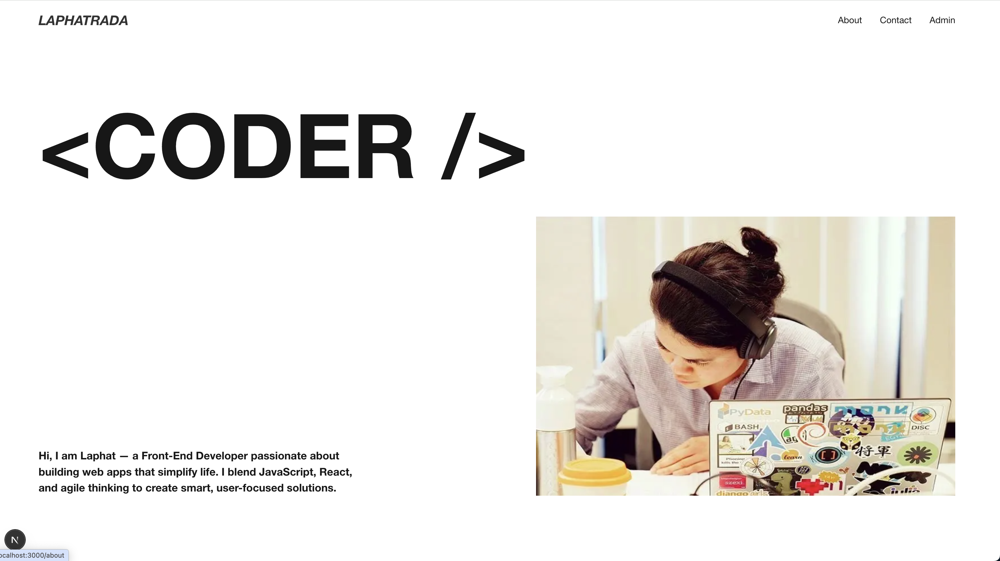
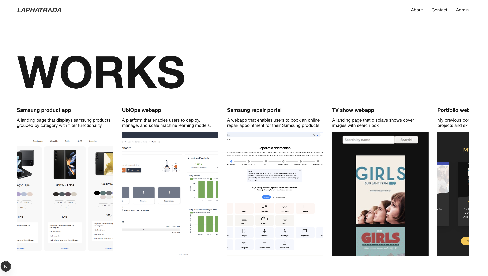
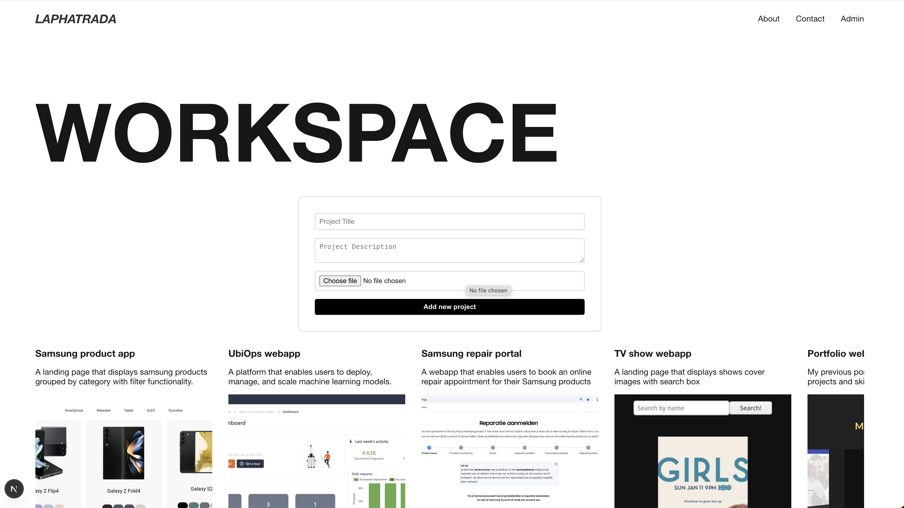

# Portofolio website

## Installation
```bash
git clone https://github.com/Laphatradap/lp_portfolio.git
npm install
npm start
```
## Technologies used
- Next.js
- Typescript
- Styled components
- mockAPI.io - simulate APIs
- Uploadcare - file uploader

## Features implemented
- Portfolio page, displaying work experiences including title, description and images
- About me page
- Contact page
- Admin page to login into the admin panel
(for testing: username: admin, password: test123)
- Admin panel to manage projects - add, edit and delete

## To dos 
A few improvements need to be made, listed in order of priority.
- mobile styling
- admin section - propre credentials
- utilize Next.js' features for performance optimization
- fix issue with Image component from next.js and hydration issue
- setup proper backend API
- write tests


## Screenshots
 <br />
 <br />


## Creat next app
This is a [Next.js](https://nextjs.org) project bootstrapped with [`create-next-app`](https://nextjs.org/docs/app/api-reference/cli/create-next-app).